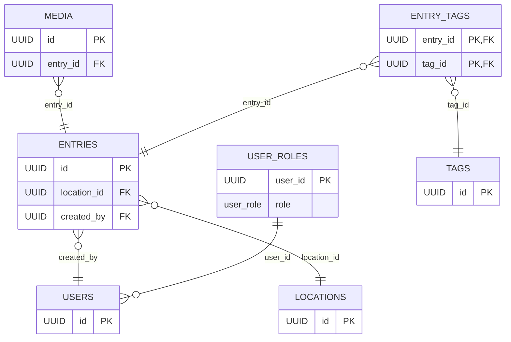

# Supabase Configuration

This directory contains the configuration and setup for Supabase authentication and database.

## Directory Structure

```
supabase/
├── migrations/     # SQL migration files
├── types/         # TypeScript type definitions
├── config/        # Configuration files
└── utils/         # Utility functions
```

## Database Schema

### Tables

1. **entries**
   - Main content table for user entries
   - Contains title, description, location, and metadata

2. **media**
   - Stores references to uploaded media files
   - Links to Supabase Storage
   - Supports both images and videos

3. **tags**
   - Manages content tags
   - Includes preset and custom tags

4. **locations**
   - Stores location data
   - Includes city, ward, and custom locations

### Schema Diagram



### Storage Buckets

1. **media**
   - Stores all uploaded media files
   - Organized by entry ID
   - Supports image and video formats

## Security Policies

- Public read access for media
- Authenticated write access
- Rate limiting for uploads
- File size and type restrictions

## Usage

1. **Migrations**
   - Run migrations in order using the Supabase CLI
   - Each migration is timestamped and versioned

2. **Types**
   - Generated TypeScript types for database tables
   - Used throughout the application for type safety

3. **Configuration**
   - Environment variables and connection settings
   - Storage bucket configurations
   - Security policy definitions

## Development

1. Install Supabase CLI:
   ```bash
   npm install -g supabase
   ```

2. Link to your Supabase project:
   ```bash
   supabase link --project-ref your-project-ref
   ```

3. Run migrations:
   ```bash
   supabase db push
   ```

## Best Practices

1. Always create new migrations for schema changes
2. Test migrations locally before deploying
3. Keep types up to date with schema changes
4. Document all security policies
5. Use environment variables for sensitive data 

## Database Setup

1. Run the migration file to create the necessary tables and policies:
   ```sql
   -- Run this in the Supabase SQL editor
   \i migrations/20240320000000_auth_setup.sql
   ```

2. Verify the tables and policies:
   ```sql
   -- Check tables
   \dt public.*

   -- Check policies
   \dp public.profiles
   \dp public.user_settings
   ```

## Authentication Setup

1. Configure Authentication Providers:
   - Go to Authentication > Providers
   - Enable Email provider
   - Configure password requirements
   - Enable Magic Link if needed
   - Configure social providers if needed

2. Configure Email Templates:
   - Go to Authentication > Email Templates
   - Update the templates for:
     - Confirmation
     - Magic Link
     - Reset Password
     - Change Email

3. Configure Redirect URLs:
   - Go to Authentication > URL Configuration
   - Add the following redirect URLs:
     - `http://localhost:5173/auth/callback`
     - `http://localhost:5173/auth/reset-password`
     - `http://localhost:5173/auth/update-password`
     - Add production URLs when deploying

4. Configure Security Settings:
   - Go to Authentication > Security
   - Set session expiry time
   - Configure refresh token settings
   - Set up MFA if needed

## Environment Variables

Add the following environment variables to your `.env` file:

```env
VITE_SUPABASE_URL=your_supabase_url
VITE_SUPABASE_ANON_KEY=your_supabase_anon_key
VITE_SITE_URL=http://localhost:5173

# Optional: Social Auth Providers
# VITE_GOOGLE_CLIENT_ID=your_google_client_id
# VITE_GOOGLE_CLIENT_SECRET=your_google_client_secret
# VITE_GITHUB_CLIENT_ID=your_github_client_id
# VITE_GITHUB_CLIENT_SECRET=your_github_client_secret
```

## Security Considerations

1. Row Level Security (RLS):
   - All tables have RLS enabled
   - Policies ensure users can only access their own data
   - Triggers handle data consistency

2. Password Security:
   - Minimum length: 6 characters
   - Requires special characters
   - Requires numbers
   - Requires uppercase and lowercase letters

3. Session Security:
   - Session expiry: 1 hour
   - Refresh token expiry: 7 days
   - Secure cookie settings

4. Email Security:
   - Email verification required
   - Secure password reset flow
   - Magic link authentication option

## Testing

1. Test the authentication flow:
   - Sign up
   - Email verification
   - Sign in
   - Password reset
   - Magic link

2. Test the database policies:
   - Create a new user
   - Verify profile creation
   - Test RLS policies
   - Test data deletion

## Troubleshooting

1. Email Issues:
   - Check SMTP settings
   - Verify email templates
   - Check spam folders

2. Authentication Issues:
   - Verify redirect URLs
   - Check provider settings
   - Review security settings

3. Database Issues:
   - Check RLS policies
   - Verify triggers
   - Review table permissions 